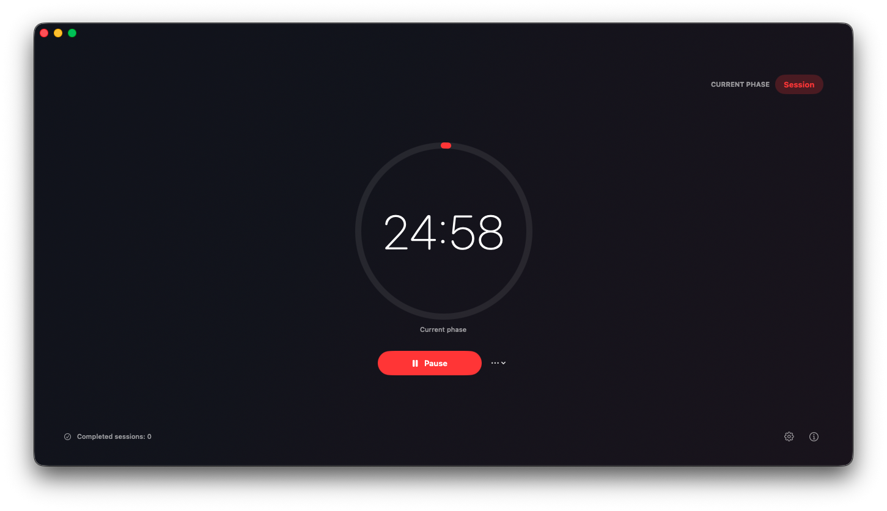
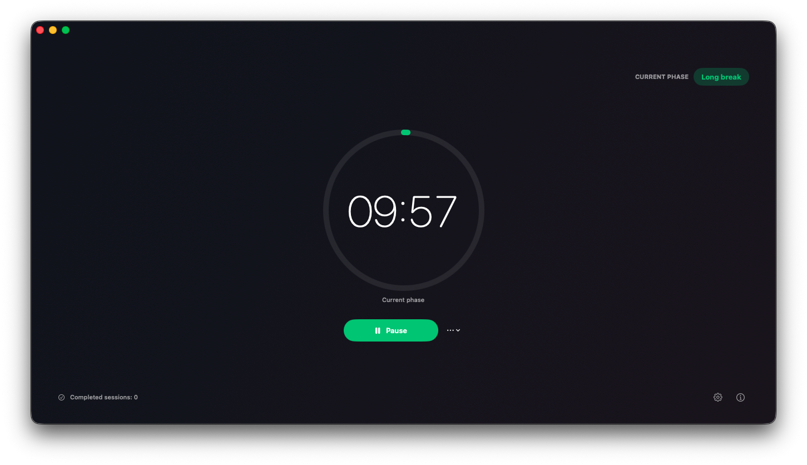
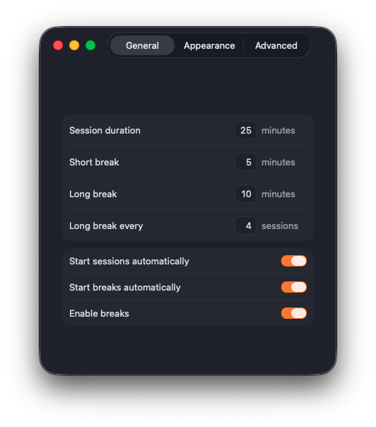
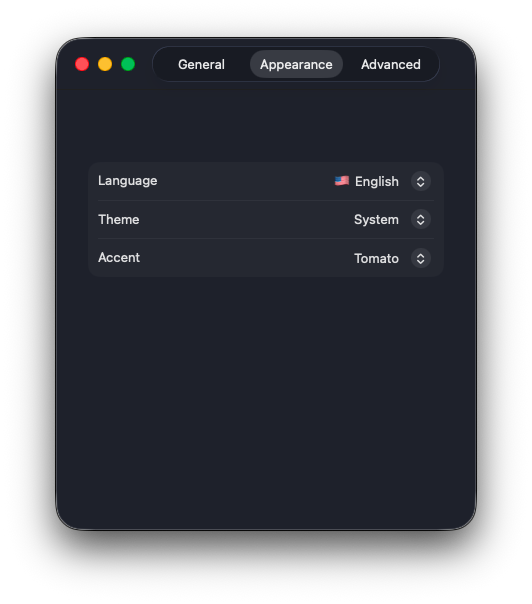
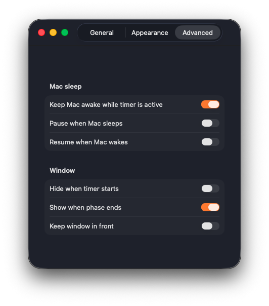

<p align="center">
  
</p>

<h1 align="center">Tomito vlv</h1>

<p align="center">A calmer, open-source Pomodoro timer for macOS.</p>

<p align="center">
  
  
  
</p>

Tomito vlv keeps Pomodoro focused: a beautiful timer, useful breaks, menu-bar controls, and no clutter. It is local-first, private by design, and yours to inspect or improve.

<p align="center">
  
  
</p>

## Why Tomito vlv?

- **Focused by default** — Sessions, short breaks, and long breaks without history dashboards, widgets, sounds, or distractions.
- **Mac-aware** — Optional notifications, sleep/wake behavior, and a power assertion that keeps your Mac awake while a timer runs.
- **Bilingual** — Starts in English. Switch to `🇺🇸 English` or `🇲🇽 Español` from Preferences.
- **Native and open** — SwiftUI + AppKit, no accounts, no analytics, no network dependency.

## Included in v1.0.0

| Area | What you get |
| --- | --- |
| Timer | Start, pause, resume, stop, restart, skip; session, short-break, and long-break cycles |
| Automation | Configurable durations, long-break interval, automatic session/break starts |
| macOS | Menu-bar controls, local notifications, optional window behavior |
| Sleep | Keep Mac awake while active; pause on sleep; optionally resume on wake |
| Appearance | System, light, or dark mode; tomato or forest accent |
| Language | English default plus Spanish selector with country flags |
| About | App icon, v1.0.0, GitHub and SourceForge project links |

Not included: history/statistics, timer widget, sounds, global shortcuts, AppleScript, analytics, or accounts.

## Preferences, your way

<p align="center">
  
  
  
</p>

Configure durations and automatic phases, pick English or Spanish plus a system, light, or dark theme, then choose sleep and window behavior that fits your workday.

## Get Tomito vlv

### Current release: v1.0.0

Download the app from [GitHub Releases](https://github.com/VlV-515/tomito-vlv/releases). SourceForge mirror files are prepared separately.

### From source

```bash
swift build
./scripts/package-app.sh
open "dist/Tomito vlv.app"
```

The app bundle is ad-hoc signed, not Developer ID signed, and not notarized. macOS may show a Gatekeeper warning on first launch.

## Links

- [GitHub repository](https://github.com/VlV-515/tomito-vlv)
- [SourceForge project URL](https://sourceforge.net/projects/tomito-vlv/)
- [User documentation](docs/README.md)
- [Contributor guide](AGENTS.md)

## License

MIT. See [LICENSE](LICENSE).
